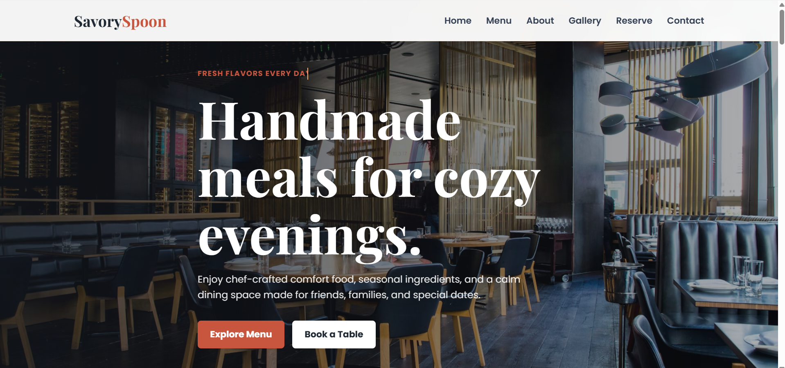
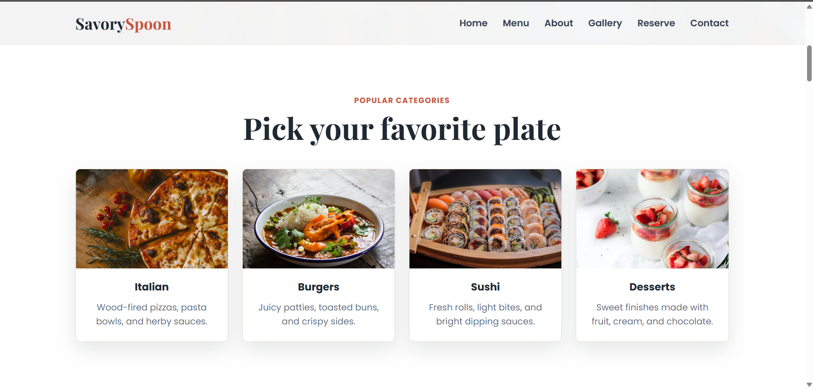
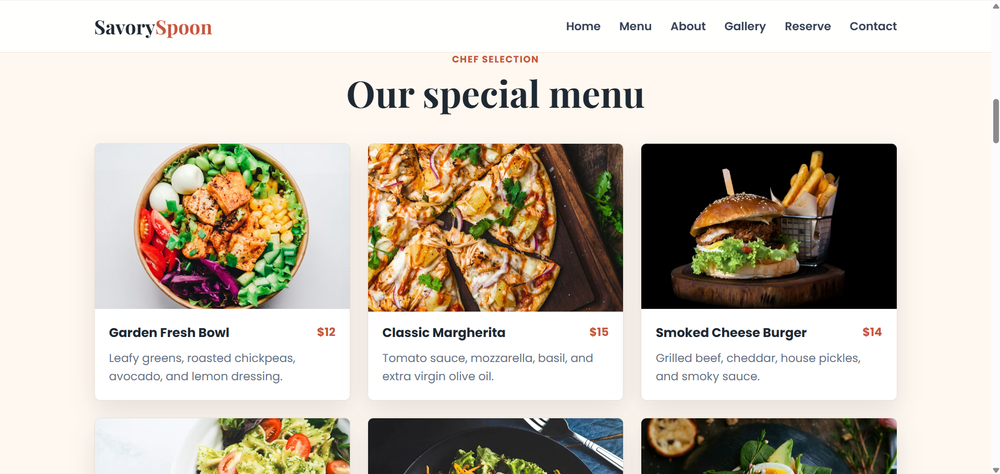
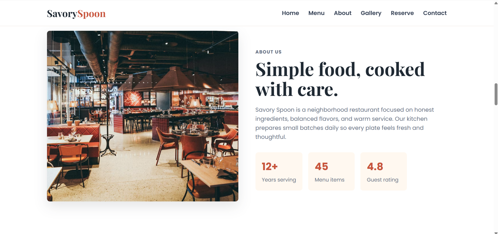
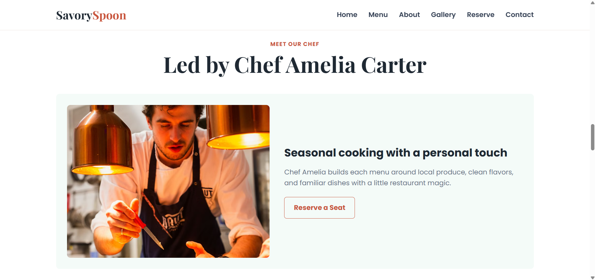
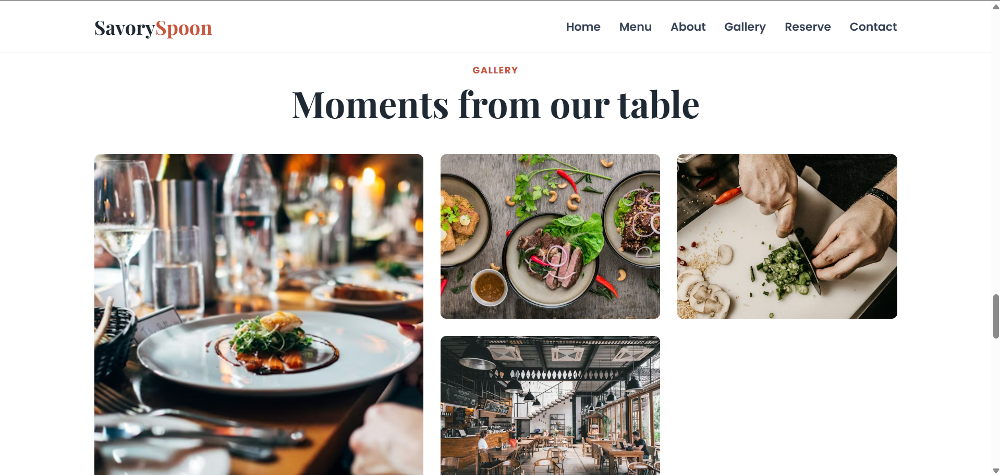
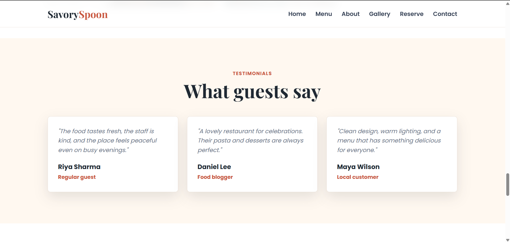
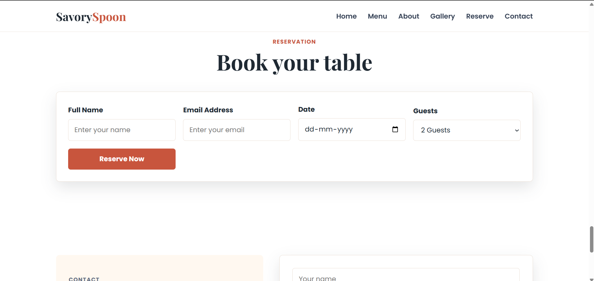
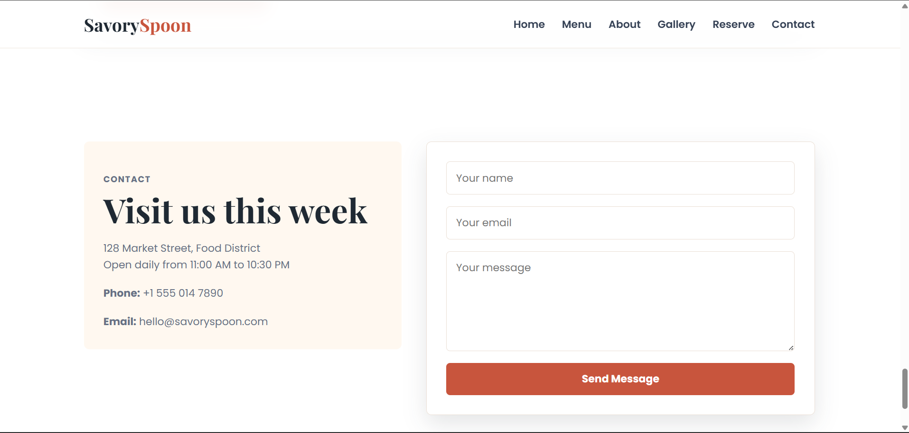
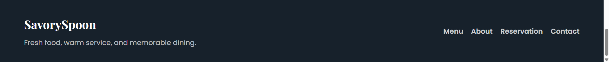

# Restaurant Website 🍽️

A modern and fully responsive Restaurant Website built using **HTML5** and **CSS3**.  
This project showcases a clean UI/UX design with responsive layouts, attractive food sections, smooth animations, and modern frontend styling suitable for frontend portfolio and internship projects.

---

## 🚀 Features

- Responsive Navigation Bar
- Full-Screen Hero Section
- Food Menu Cards
- Categories Section
- About Restaurant Section
- Chef Section
- Testimonials Section
- Reservation Form UI
- Gallery Section
- Footer Section
- Smooth Scrolling
- Hover Effects & Transitions
- Responsive Design for Mobile, Tablet & Desktop
- Modern UI/UX Design

---

## 🛠️ Technologies Used

- HTML5
- CSS3
- Flexbox
- CSS Grid
- Media Queries

---

## 📱 Responsive Design

This website is fully responsive and optimized for:

- Mobile Devices
- Tablets
- Desktop Screens

---

## 🎨 UI/UX Features

- Modern Restaurant Layout
- Professional Color Palette
- Attractive Food Cards
- Clean Typography
- Proper Spacing & Alignment
- Smooth Hover Animations
- Minimal & Elegant Design

---

## ✨ Animations & Interactions

- Hover Effects on Food Cards
- Button Hover Transitions
- Smooth Scrolling
- Image Hover Zoom Effects
- Lightweight Animations

---

## ⚡ Performance Optimization

- Optimized Images
- Fast Loading Design
- Clean CSS Structure
- Lightweight UI Effects

---

## 📂 Project Structure

```bash
Restaurant-Website/
│
├── index.html
├── style.css
├── assets/
│   ├── images/
│   └── icons/
│
└── README.md
```

---

## Sections Included

- Home
- Menu
- Categories
- About
- Chefs
- Testimonials
- Reservation
- Gallery
- Contact/Footer

## 📸 Screenshots

### Homepage



### Categories



### Menu Section



### About Section



### Chef



### Gallery Section



### Testimonials Section



### Reservation



### Contact Section



### Footer Section



## 🎯 Purpose of the Project

This project was created to practice and demonstrate:

- Responsive Web Design
- HTML & CSS Layout Skills
- Modern UI/UX Design
- Flexbox & CSS Grid
- Frontend Development Skills

---

## 🌐 Future Improvements

- Add JavaScript functionality
- Online food ordering system
- Dark mode support
- Backend integration
- Reservation form functionality

---

## 📌 Internship Value

This project demonstrates:

- Clean Frontend Development
- Responsive Website Design
- Professional UI/UX Skills
- Real-World Layout Building
- Modern Web Design Practices

---

## 👨‍💻 Author

Developed by **ALLEM SAMYEL**

GitHub: https://github.com/AllemSamyel-03

Portfolio: https://your-portfolio-link.com
